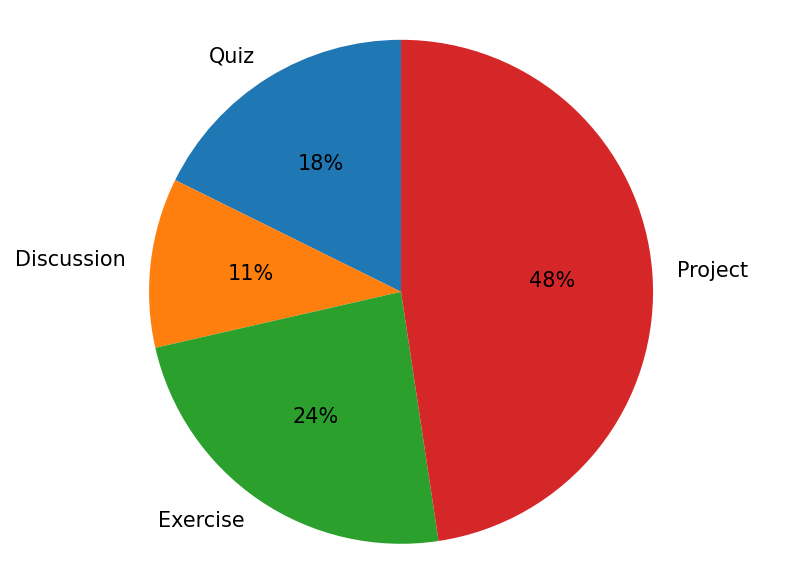

# ART 1184–71, Photography I Syllabus, Fall, 2026

## Course Information

- **Semester:** Fall, 2026
- **Course Number/Section:** ART 1184–71
- **Credits:** 3 credits
- **Hours per week:** 5 hours/week (1 lecture, 4 lab)
- **Delivery Method:** online
- **Prerequisites:** None

- **Meeting Times:** Online asynchronous. There are no scheduled meeting times.

- **Classroom:** Online course. There is no classroom.

- **Instructor:** Brian Steele, brian.steele@rctc.edu
- **Office Phone:** 507-536-5608
- **Student Meeting Hours:** I meet with students in my office during the following hours:
  - **Monday:** 12:00 p.m. - 2:00 p.m.
  - **Tuesday:** 12:00 p.m. - 2:00 p.m.
  - **Wednesday:** 12:00 p.m. - 2:00 p.m.
  - **Thursday:** -
  - **Friday:** -
  - **Note:** I am available in my office to meet with students during these hours. Please email me before you come to my office, so I know to expect you. I am also happy to meet with you on Zoom if you can't come to campus or set up a time to meet outside of those hours if they don't work for you. Please email me.
- **Office location:** EA 222

### I have a question or an issue. How can I reach you?

The best way to reach me is by email. I will do my best to get back to you by the end of the next working day (Monday-Friday). I may not answer emails on weekends or official holidays.

### Am I ready to take this course?

There are no courses you are required to take before enrolling in this class. Students come to Photography I with a wide range of experience—some have never used a dedicated camera before, and others have been taking photographs for years. This course is designed to work for all of those students.

The most important part of this course is growth. You will be learning new skills, and you should expect to spend time practicing, studying examples, and making photographs. That is normal for a college-level studio art course.

Anyone can learn these skills with practice and effort. Some assignments may take more time than you expect at first, especially early in the semester, and that's okay. If you stay engaged, ask questions, and keep working, you can be successful in this course.

### What is this course about (Catalog Description)?

This course is an introduction to creative digital photography. Students will make photographs that explore fundamental compositional strategies using digital cameras and editing software. Instruction will include the exploration of photographic concepts through media presentations, group discussions, and video tutorials. Additional instruction will cover the history of photography, and computer techniques. Students will learn to interpret and analyze images, including student work through classroom critiques and discussions.

### How does this course work?

This is an art studio course that emphasizes the active production of photographic images. Learning in this course happens through making photographs, not just reading or watching demonstrations. Participation online and consistent time spent working with a camera and computer are essential. You should expect to make photographs every week. Assignments may overlap. We will be working together on critiques and exploring photographs, including student work. If you are struggling, confused, or falling behind, ask early. Seeking clarification and support is a sign of professionalism, not failure.

### What is this course going to cover (Outline of Specific Content)?

1. Camera, Lens, and Exposure Techniques
2. Aesthetics and Composition
3. Processing Images using digital applications
4. Cultural Investigation and history of Photography
5. Interpretation and analysis of photography

### Course Learning Outcomes and Competencies

1. Demonstrate a knowledge of the elements of art and the principles of design in photographic compositions.
2. Demonstrate skill and technical knowledge with camera controls, digital imaging software and presentation.
3. Identify significant photographers and important photographic movements.
4. Articulate an informed personal reaction to technical and aesthetic concerns when viewing photographs.

### What transfer goals does this course satisfy (MnTC Goals)?

Goal 6/Humanities – the Arts, Literature, and Philosophy: The student will be able to:
- Understand works as expressions of individual and human values within a historical and social context.
- Engage in the creative process or interpretive performance.
- Articulate an informed personal reaction to works in the arts and humanities.

### This course contributes to meeting the following RCTC Core Learning Outcome(s):

 - Critical Thinking

## Course Materials

### What textbook will I need for this course (Readings/Required Textbooks)?

 - There is no required textbook for the course.
 - You will be required to watch several hours of online videos from LinkedIn Learning instead of using a textbook.
 - There will be short quizzes based on the videos.

### Do I need a camera for this class?

**REQUIRED - Necessary Equipment**

 - Interchangeable-lens digital camera with manual controls and RAW file support (phone cameras are not sufficient for this course)
 - Look for information about checking out a camera on D2L/Brightspace. Online students must be able to travel to campus to pick up and return checked-out equipment.

### What software do I need for this class?

 - Adobe Lightroom (license provided through student fees)

### Are there any special fees associated with this class?

 - A $20 course fee for access to Adobe software has already been charged to your student account. Please do not pay additional fees directly to Adobe. Contact your instructor if you have questions about software access.

### Can I check out a camera from the Art Department?

The RCTC Art+Design department has some DSLR cameras you can check out for free.

To check out a camera:

- Fill out the form that I provide a link to on D2L/Brightspace.
- We only have 25 to 30 cameras available to check out. Often, we have enough cameras that every student can use their own, but:
  - If more students need cameras than we have available, we will ask that the cameras get returned once a week. In a couple of days, you will be able to check out a camera again.
  - Instructors will work to accommodate students who are waiting for a camera during an assignment.
- Student accounts will be charged for cameras that are lost, stolen, not returned, or broken. This includes students who forget to return the cameras at the end of the semester or drop the class early without returning the camera.

### Computer

For this section, you need to have a computer that meets the minimum requirements to run Adobe Lightroom. You can see the requirements at https://helpx.adobe.com/creative-cloud/system-requirements.html

**Windows:**

- Intel® or AMD processor with 64-bit and SSE 4.2 support; 2 GHz or faster processor
- Runs Microsoft Windows 10 or Windows 11
- 8 GB of RAM minimum/16 GB recommended
- 10 GB of hard drive space

**Mac:**

- Multicore Intel processor with 64-bit support or Apple silicon processor
- macOS 14 or later
- 8 GB of RAM minimum/16 GB recommended
- 10 GB of hard drive space

**Other Important Information**

- **You are welcome to come to campus to use the computers in the Mac labs for this course**.
- The version of Lightroom we need to use will not work on iOS, Android, ChromeOS, Linux, or other operating systems. You will need a laptop or desktop running Windows 10, Windows 11, or macOS 14 or later.
- **Chromebooks will not work for this course.** There is a web-based version of Lightroom available for Photography I students, but you might be happier with the app version you install, and this won't install on a Chromebook. You cannot install any of the Creative Cloud applications (Lightroom, Photoshop, InDesign, etc) on a Chromebook.
- **Chromebooks managed by local schools often block important resources.** Many students report that they cannot access resources like LinkedIn Learning on school managed laptops, and you will need to access them to complete homework.
- **iPhones, iPads, and other tablets can install Lightroom, but may have other issues with assignments.** It can be a challenge to turn in work to D2L from those devices. There are many ways they are useful, though. Talk to me about using them before you use them for assignments.
- **Don't use camera wireless connections to your phone.** They degrade the quality of the image before sending it to your phone, the downloading is slow if you have a lot of images, and using a USB card reader attached to your computer is generally a better experience.
- **You will need an SD card reader for your computer.** Many computers have them built in already. If you check out a camera from the art department, we will provide a card reader. You can pick one up at Target, Walmart, or Amazon.
- For students who do not have an appropriate computer at home, RCTC’s Technology Support Center has some laptops available for checkout for the semester. You can find information at https://www.rctc.edu/services/technology/tsc/, call 507–536–5555, 1–800–247–1296 / TTY Relay 1–800–627–3529, or email tech.help@rctc.edu.

### Will I need internet access at home?

You will want broadband internet access at home for this class, preferably a cable modem or DSL connection.

You need a computer connected to the internet to complete and turn in assignments.

For students who do not have broadband internet access, RCTC’s Technology Support Center has some wireless access points available for checkout for the semester. You can find information at https://www.rctc.edu/services/technology/tsc/, call 507–536–5555, 1–800–247–1296 / TTY Relay 1–800–627–3529, or email tech.help@rctc.edu.

### Is there anything else I will need for this class?

 - An SD card would be useful
 - You will need an SD card reader

## Course Policies

### Preferred names and pronouns

If you prefer to be addressed by a name that is not on the enrollment list, or you have a preferred pronoun, I would like to honor that. Please feel free to communicate that to me.

### What is the attendance policy for this course?

**REFERENCE INFORMATION - You don't need to read this now**

- This class is presented entirely online. In-person attendance policies do not apply. These are the online participation policies.
- Students must participate in at least one graded activity every two weeks — a quiz, a discussion, or an assignment.
- Students who have not completed a graded activity in the last two weeks will be given an FW for a course grade, which will also withdraw them from the course.
- This policy is a request of the RCTC administration. Students who are dropped early in the semester with an FW can sometimes get some of their tuition money back for the course.
- If you receive a grade of FW, please contact your academic advisor and coach right away and make sure you understand what your next steps are.
- If you’re facing challenges that may impact your course participation, please reach out so we can discuss how to keep you on track.
- If you find yourself behind on course material, that’s a signal to reach out early.

### Will I have to work beyond reading/watching material on D2L/Brightspace to complete my projects?

Yes. Completing projects requires substantial work beyond reading and watching the materials in the weekly D2L/Brightspace modules.

### What is the policy for late work?

**REFERENCE INFORMATION - You don't need to read this now**

- Graded work (quizzes, discussions, assignments, etc.) will have due dates published in the syllabus and D2L. It's important to follow the due dates to keep on track with the course.
- Graded work may be handed in up to three days late. Late work may have a grade penalty applied.
- In D2L, each item will have an "End Date" when the item will close and will no longer be available to hand in or do work.
- I can open assignments that are past the end dates for extreme circumstances. Email me, and we can discuss the situation.
- I will only open three assignments or quizzes that have closed for any given student. I will keep track in the D2L/Brightspace grades. Plan thoughtfully.
- I will do my best to email your RCTC email account and let you know if you have missed a due date. Please check your RCTC email regularly.
- D2L/Brightspace doesn't allow me to open discussions for individual students, so I won't do that.

### Can I work in the lab/classroom outside of class time?

**IMPORTANT**

- **Students in online courses are welcome to use the Mac labs on campus to complete their work**.
- Please do not interrupt an instructor during a lecture or critique.
- Try to use a computer in the back of the lab.
- The instructor has the right to say, “No, not right now” and you must respect that.
- Instructors who are giving demonstrations in the print room or the lighting studio have priority and may ask you to leave the lab.

## Grading

### What matters most for my course grade?

The bulk of the points in this course come from exercises and projects. If an assignment asks you to use your camera, it is very important that you turn something in on time. Please note that my grading rubrics are forgiving, and you can get some points for handing in any work for a project or exercise. Participation in online discussions also contributes to your grade. The quizzes and papers matter to doing well, but are not as large a part of the grade as exercises and projects. It's also important to remember that the skills from the quizzes and projects build on one another. If you miss several quizzes, exercises, or projects, you may find that later assignments may feel much harder.

### How will this class be graded?

- Student learning is assessed through photographic projects, exercises, quizzes, written reflections, and participation in critiques and discussions.
- Most assignments will have a grading rubric available either in the assignment description or in the assignment drop box for submission.
- The course does not have a signature assessment.

### How will you compute our final grades for the course?

D2L will add up your points in the online grade book and compute a percentage score for the points you have earned. I will use the standard RCTC grade scale to figure out the letter grade.

Please note that RCTC doesn’t use pluses or minuses for final grades.

### How does the final grade break down?

**IMPORTANT INFORMATION - Return to as needed**
**Assignments by Points Value**

| Category | Points |
| -------- | :----: |
| Syllabus Quiz | 2 |
| Week 1 Discussion: Introductions | 1 |
| Computer Quiz | 2 |
| D2L/Brightspace, Email, and OneDrive Quiz | 2 |
| Computer Exercise | 5 |
| Composition 1 Quiz | 2 |
| Week 2 Discussion | 1 |
| Camera Quiz | 2 |
| Camera Exercise | 5 |
| Camera Exercise Worksheet Images | 5 |
| Week 3 Discussion | 1 |
| Lightroom Importing, Organizing, and Exporting Images Quiz | 2 |
| First Light Project | 10 |
| Week 4 Discussion | 1 |
| Week 5 Discussion: First Light Project Critique | 1 |
| Lenses Quiz | 2 |
| Reciprocity Quiz (ungraded) | 0 |
| Focal Length Exercise | 5 |
| Depth of Field Exercise | 5 |
| Week 6 Discussion: Focal Length and Depth of Field Critique | 1 |
| Shutter Speed Quiz | 2 |
| Week 7 Discussion: Shutter Speed Critique | 1 |
| Composition 2 Quiz | 2 |
| Shutter Speed Exercise | 5 |
| Depth-Blur Project | 10 |
| Week 8 Discussion: Depth-Blur Critique | 1 |
| Correcting Images Part 1 Quiz | 2 |
| Correcting Images Part 2 Quiz | 2 |
| Composition 3 Quiz | 2 |
| Correcting Images Exercise | 5 |
| Image Analysis Paper | 10 |
| Week 9 Discussion | 1 |
| Week 10 Discussion: Correcting Images Critique | 1 |
| Point of View Project | 10 |
| Week 11 Discussion: Point of View Critique | 1 |
| Portraits and Lighting Quiz | 2 |
| Four Kinds of Light Portraits Project | 10 |
| Week 12 Discussion: Four Kinds of Light Portraits Critique | 1 |
| Final Project | 20 |
| Week 13 Discussion | 1 |
| Week 14 Discussion | 1 |
| Week 15 Discussion | 1 |
| Week 16 Discussion: Final Project Critique | 1 |
| **Total** | **147** |

**Categories of Assignments by Percentage of Final Grade**

| Category | Percentage |
| -------- | :--------: |
| Quiz | 17.69 |
| Discussion | 10.88 |
| Exercise | 23.81 |
| Project | 47.62 |
| **Total** | **100.0%** |

### Can you show me a chart of how my final grade is computed?

### How are the assignments graded?

Each assignment will have a grading rubric in D2L/Brightspace. You should read the rubric before starting your assignment. The grading rubric will break down, point by point, what I am looking for in the assignment. I will post grades on D2L/Brightspace.

### How soon will grades be posted on D2L/Brightspace?

- Quizzes should be set up to be graded immediately in D2L/Brightspace.
- Projects that involve shooting images will take seven to ten days after the due date to grade.

## Request for alternative feedback.

At times, I may provide feedback in the form of an audio or video recording. If you would like an alternative format, please inform me by email.

## AI and Academic Integrity

### What happens if I cheat in this course (Academic Integrity)?

The primary academic mission of Rochester Community and Technical College (RCTC) is to provide quality learning opportunities for students. Acts of academic dishonesty undermine the educational process and the learning experience for the student and our college community. It is the responsibility of the student to complete their academic requirements with integrity and not engage in acts of cheating, plagiarism, or collusion. The College expects that students are submitting work and materials that reflect their individual learning and efforts within their course, program, and college academic requirements.
It is expected that RCTC students will understand and adhere to the concept of academic integrity and to the standards of conduct outline within this policy (Policy 3.6.2 Academic Integrity). Students who are found to have engaged in an act of academic dishonesty may face academic sanctions through the Academic Integrity Procedure and non-academic misconduct sanctions through the Code of Student Conduct.

### May I use ChatGPT or other generative A.I. tools in this course?

Generative AI is constantly changing, and writing a policy for it is challenging. If AI use becomes an issue in your work, here’s what you need to know:

- In this course, use of AI is limited.
- I will specify when an assignment may use AI in the instructions for the assignment, quiz, or discussion.
- This course values process, experimentation, and decision-making. Those are skills that you only develop by doing the work yourself.
- Please don’t use ChatGPT on assignments in this course if it isn't explicitly allowed. This course asks you to think critically. ChatGPT short-circuits your critical thinking if you use it to complete your work for you.
- If you are unsure of your writing, that is okay. This course is an early encounter with art and not everyone in the course will have English writing experience. I prefer you hand in honest writing with spelling and grammar problems than AI-generated content.
- If I think you are using AI to complete an assignment, I will let you know. I may use TurnItIn tools to help identify AI-generated content. I will grade AI-generated work based on the work’s merit and using any grading rubrics associated with the assignment.
- LLMs are not suitable for completing assignments for this course. Students who use them often don't notice factual errors in their work.
- Tools like Grammarly now use AI. If a program generates, significantly rewrites, or translates text, it may show up on AI detection tools. Simple spell checking shouldn’t be an issue.
- If you want to use AI tools in this course without violating academic integrity, reach out to me and we can discuss how.

## RCTC Policies

### I have a health or learning difference that will require some accommodations. How do I set those up (Americans with Disability Act)?

Rochester Community and Technical College is committed to ensuring its programs, services and activities are accessible to individuals with disabilities, through its compliance with state and federal laws, and System Policy. Appropriate accommodations are provided to those qualified students with disabilities. If you believe you qualify for an academic accommodation, please contact the Director of Disability Support Services, Travis Kromminga at 507-280-2968 or through the Minnesota relay TTY 1-800-627-3529. The office can also be reached via e-mail at **travis.kromminga@rctc.edu**.

- **Travis Kromminga**, RCTC’s Director of Disability Support Services
  Phone: 507-280-2968
  TTY: 1-800-627-3529
  Email: travis.kromminga@rctc.edu

- **Minnstate System Policies***
  [Access and Accommodations for Individuals with Disabilities](https://www.minnstate.edu/board/policy/1b04.html)

### I am a military veteran, are there services available on campus (Military Friendly Statement)?

Rochester Community and Technical College (RCTC) is a military friendly campus, pledging to do all we can to help military veterans transition into college to complete their educational goals. RCTC is proud to serve and honor our veterans and military service members and their families. Through the Veterans Resource Center, RCTC offers student veterans an on-campus point of contact with other veterans, and program information to assist them in making a successful transition into college.

For assistance, students are encouraged to contact:

- **Mark Larsen**, Veterans Assistant Coordinator  
  Phone: 507-779-9375  
  Email: mark.larsen@state.mn.us

- **Othelmo da Silva**, RCTC’s VA Certifying Official  
  Phone: 507-285-7566  
  Email: VeteranServices@rctc.edu

### What are the campus policies about sexual harassment, misconduct, or violence (Title IX Statement)?

Title IX of the Education Amendments of 1972 states: “No person in the United States shall, on the basis of sex, be excluded from participation in, be denied the benefits of, or be subjected to discrimination under any education program or activity receiving federal financial assistance.” 

Today, Title IX ensures that sex-based discrimination, including that related to pregnancy/parenting, sexual orientation, and gender identity, is responded to promptly and effectively with a fair, transparent, and reliable process.

Anyone who believes there has been an act of discrimination, harassment, or violence on the basis of sex against any person or group in a college-sponsored program or activity may file a complaint through the reporting form to the Title IX Coordinator, **Dr. Teresa Brown**.

Pregnant and parenting students may reach out to the Title IX Coordinator, Dr. Teresa Brown, to learn about their rights and available supports under Minnesota State Board Procedure 1B.1.3 Access and Modifications for Pregnant and Parenting Students. Students may use the contact information above or submit a request via this form. Pregnant and parenting students may also contact Anfa Diiriye, the Parenting Student Navigator at anfa.diiriye@rctc.edu to learn about college and community resources that support parents and families.

- **Dr. Teresa Brown**, RCTC's Title IX Coordinator
  Phone: 507-285-7217
  Email: titleix@rctc.edu
- **Anfa Diiriye**, RCTC's Parenting Student Navigator
  Email: anfa.diiriye@rctc.edu
- **Minnstate Policy** 
  [Access and Modifications for Pregnant and Parenting Students](https://www.minnstate.edu/board/procedure/1b01p3.html)

## Course Schedule Overview

**REFERENCE INFORMATION - You don't need to read this now**

| Week | Topic | Readings | Projects | Discussions | Exams | Due Date |
| ---- | ----- | -------- | -------- | ----------- | ----- | -------- |
| 1 | Introductions | · Syllabus | | · **D1**: Week 1 Discussion: Introductions  |  · **Q1**: Syllabus Quiz  | 08/30/26 |
| 2 | Computer Literacy | · macOS or Windows 10 LinkedIn Learning Video Playlist · D2L/Brightspace, Email, and OneDrive LinkedIn Learning Video Playlist · Composition I LinkedIn Learning Video Playlist | · **E1**: Computer Exercise | · **D2**: Week 2 Discussion  |  · **Q2**: Computer Quiz   · **Q3**: D2L/Brightspace, Email, and OneDrive Quiz   · **Q4**: Composition 1 Quiz  | 09/06/26 |
| 3 | Cameras | · Canon or Nikon LinkedIn Learning Video Playlist · Camera Overview Videos | · **E2**: Camera Exercise | · **D3**: Week 3 Discussion  |  · **Q5**: Camera Quiz  | 09/13/26 |
| 4 | Lightroom I | · Importing and Exporting Images LinkedIn Learning Video Playlist | · **E3**: Camera Exercise Worksheet Images · **P1**: First Light Project **(due 09/27/26)**  | · **D4**: Week 4 Discussion  |  · **Q6**: Lightroom Importing, Organizing, and Exporting Images Quiz  | 09/20/26 |
| 5 | Lightroom I | | · **P1**: First Light Project | · **D5**: Week 5 Discussion: First Light Project Critique  | | 09/27/26 |
| 6 | Lenses | · Lenses LinkedIn Learning Video Playlist | · **E4**: Focal Length Exercise · **E5**: Depth of Field Exercise | · **D6**: Week 6 Discussion: Focal Length and Depth of Field Critique  |  · **Q8**: Reciprocity Quiz (ungraded)   · **Q7**: Lenses Quiz  | 10/04/26 |
| 7 | Shutters | · Shutter Speed LinkedIn Learning Video Playlist | · **E6**: Shutter Speed Exercise · **P2**: Depth-Blur Project **(due 10/18/26)**  | · **D7**: Week 7 Discussion: Shutter Speed Critique  |  · **Q9**: Shutter Speed Quiz  | 10/11/26 |
| 8 | Shutters | · Composition II LinkedIn Learning Video Playlist | · **P2**: Depth-Blur Project | · **D8**: Week 8 Discussion: Depth-Blur Critique  |  · **Q10**: Composition 2 Quiz  | 10/18/26 |
| 9 | Lightroom II | · Correcting Images LinkedIn Learning Video Playlist | · **E7**: Correcting Images Exercise **(due 11/01/26)**  | · **D9**: Week 9 Discussion  |  · **Q11**: Correcting Images Part 1 Quiz  | 10/25/26 |
| 10 | Lightroom II | · Correcting Images Part 2 LinkedIn Learning Video Playlist · Composition III LinkedIn Learning Video Playlist | · **E7**: Correcting Images Exercise · **P3**: Image Analysis Paper **(due 11/22/26)**  | · **D10**: Week 10 Discussion: Correcting Images Critique  |  · **Q12**: Correcting Images Part 2 Quiz   · **Q13**: Composition 3 Quiz  | 11/01/26 |
| 11 | Point of View | | · **P4**: Point of View Project | · **D11**: Week 11 Discussion: Point of View Critique  | | 11/08/26 |
| 12 | Portraits | · Portraits and Lighting LinkedIn Learning Video Playlist | · **P5**: Four Kinds of Light Portraits Project | · **D12**: Week 12 Discussion: Four Kinds of Light Portraits Critique  |  · **Q14**: Portraits and Lighting Quiz  | 11/15/26 |
| 13 | Final Project | | · **P6**: Final Project **(due 12/13/26)**  | · **D13**: Week 13 Discussion  | | 11/22/26 |
| 14 | Final Project | | | · **D14**: Week 14 Discussion  | | 11/29/26 |
| 15 | Final Project | | | · **D15**: Week 15 Discussion  | | 12/06/26 |
| 16 | Final Project | | | · **D16**: Week 16 Discussion: Final Project Critique  | | 12/13/26 |